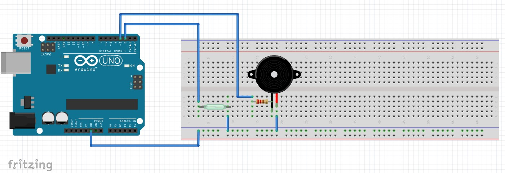
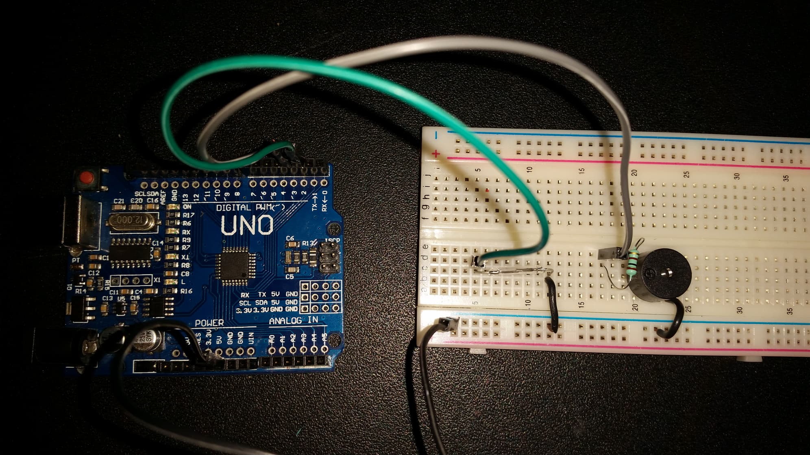

# Sistema notificador de entrada de individuos

- Instituto Tecnológico de León  
- Ingeniería en Sistemas Computacionales  
- Sistemas Programables  
- Práctica #2  
- Ana Luisa Campos Magallanes  

## Descripción

Sistema implementado en una puerta el cual activa una alarma al estar abierta.
El programa hace uso de interrupciones para optimizar el consumo de energía.

## Material

El prototipo consta de los siguientes materiales:  
- 1 Reed switch   
- 1 Buzzer  
- 1 Resistencia 100ohms  
- 1 Arduino UNO
  
## Diagrama

## Foto

